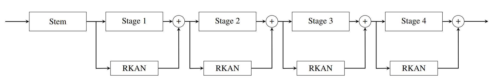
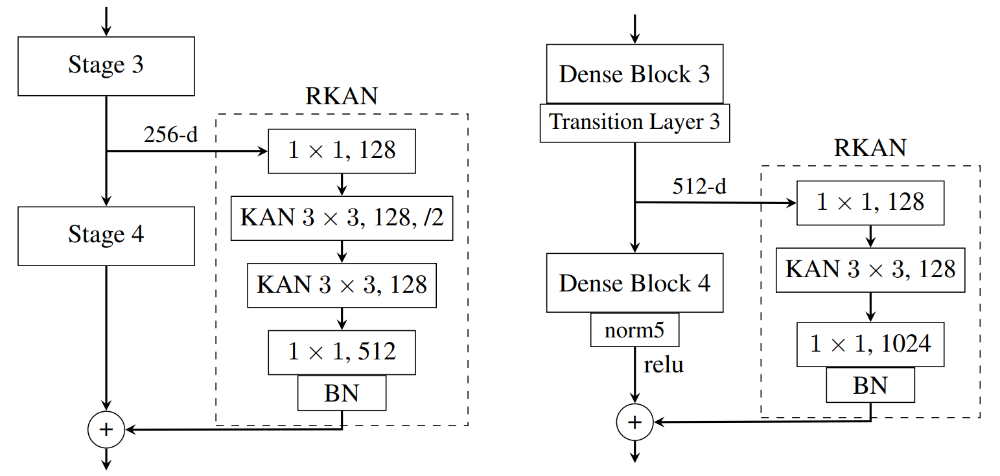

# Residual Kolmogorov-Arnold Network (RKAN)
[](https://opensource.org/licenses/MIT)
[](https://arxiv.org/abs/2410.05500)

## Overview
RKAN is designed to enhance the representational capacity and learning efficiency of classic CNNs by integrating the RKAN block around the stages of existing architectures as a residual component, so we can use it as a complementary module rather than a complete replacement of standard
convolutions. RKAN has shown notable and consistent improvements in CIFAR-100, Tiny ImageNet, STL-10, Food-101, SVHN, and ImageNet across different architectures, including ResNet, ResNeXt, Wide ResNet, DenseNet, RegNet, VGG, ConvNeXt.





You can also find our paper on [arXiv](https://arxiv.org/abs/2410.05500).

### Citation
```bibtex
@article{yu2024rkan,
  title={Residual Kolmogorov-Arnold Network for Enhanced Deep Learning},
  author={Yu, Ray Congrui and Wu, Sherry and Gui, Jiang},
  journal={arXiv preprint arXiv:2410.05500},
  year={2024}
}
```
Networks are trained from scratch for 200 epochs using stochastic gradient descent (SGD) with a weight decay of 0.001. AutoAugment and CutMix with a 50% proability are used as data augmentation. RKAN blocks are added with four configurations: (s,1) at all four stages: 1, 2, 3, and 4; (s,2) at stages 2, 3, and 4; (s,3) at stages 3 and 4; (s,4) at stage 4 only. 
Currently, we have tried different reduce factors in (s,4) where the RKAN block is only added to stage 4 of the base architecture. Results below all use a reduce factor of 1 and are implemented with the best configuration as denoted by the number in brackets. 
We are currently training on the full ImageNet dataset using a much more refined training strategy and will be posting more results soon.

## Results (upcoming)
### CIFAR-100 Results
| RKAN Model            | Top-1 Accuracy     | Base Model          | Top-1 Accuracy     |
|-----------------------|--------------------|---------------------|--------------------|
| RKAN-DenseNet-121 (s,4) | 83.09              | DenseNet-121        | 82.36              |
| RKAN-RegNetY-800MF (s,3)| 81.36              | RegNetY-800MF       | 80.19              |
| RKAN-ResNet-34 (s,3)    | 80.52              | ResNet-34           | 79.29              |

### Tiny ImageNet Results
| RKAN Model            | Top-1 Accuracy     | Base Model          | Top-1 Accuracy     |
|-----------------------|--------------------|---------------------|--------------------|
| RKAN-DenseNet-121 (s,4) | 65.42              | DenseNet-121        | 64.31              |
| RKAN-RegNetY-800MF (s,2)| 63.98              | RegNetY-800MF       | 60.11              |
| RKAN-ResNet-34 (s,3)    | 62.10              | ResNet-34           | 59.23              |
