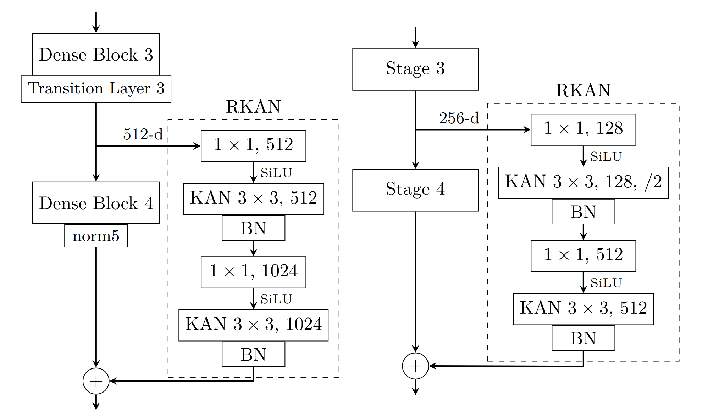
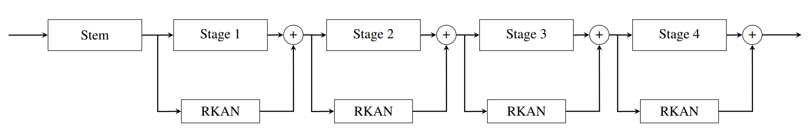
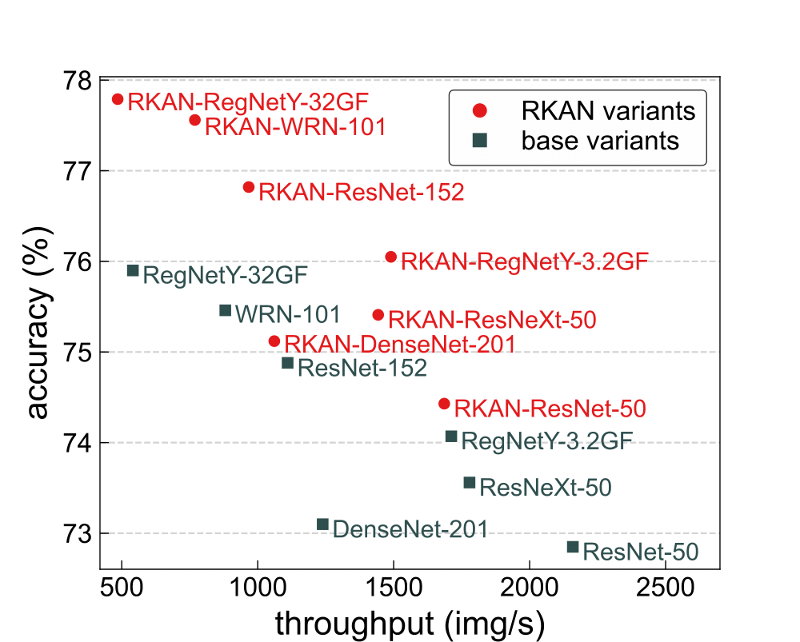
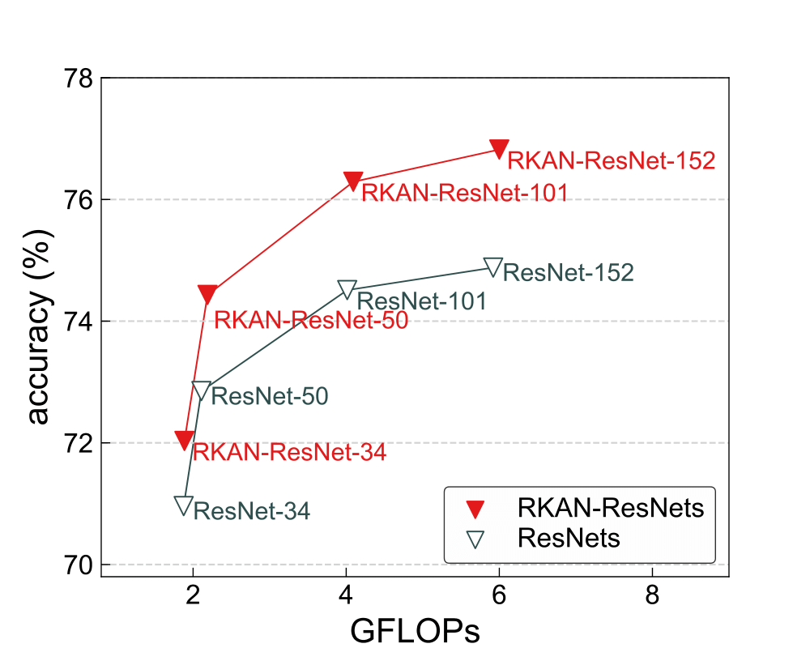

# RKAN: Residual Kolmogorov-Arnold Network
[](https://opensource.org/licenses/MIT)
[](https://arxiv.org/abs/2410.05500)

## Overview
Despite their immense success, deep convolutional neural networks (CNNs) can be difficult to optimize and costly to train due to hundreds of layers within the network depth. Conventional convolutional operations are fundamentally limited by their linear nature along with fixed activations, where many layers are needed to learn meaningful patterns in data. Because of the sheer size of these networks, this approach is simply computationally inefficient, and poses overfitting or gradient explosion risks, especially in small datasets. As a result, we introduce a "plug-in" module, called Residual Kolmogorov-Arnold Network (RKAN). Our module is highly compact, so it can be easily added into any stage (level) of traditional deep networks, where it learns to integrate supportive polynomial feature transformations to existing convolutional frameworks. RKAN offers consistent improvements over baseline models in different vision tasks and widely tested benchmarks, accomplishing cutting-edge performance on them.



RKAN is currently integrated into and tested successfully on standard ResNet, ResNeXt, Wide ResNet (WRN), ResNet-D, ResNeSt, Res2Net, ECA-Net, SENet, GCNet, CBAM, PyramidNet, RegNet, DenseNet, SA-Net, SimAM, and ELA. On CIFAR-100, Tiny Imagenet, Food-101, networks are trained from scratch for 200 epochs using stochastic gradient descent (SGD) with a weight decay of 0.0005. On ImageNet-1k, networks are trained for 100 epochs with a weight decay of 0.0001. RandAugment, CutMix with a 50\% probability (p = 0.5), and MixUp ($\alpha$ = 0.2) with a 30\% probability are used as data augmentation. On MS COCO, we use Mask R-CNN for object detection and instance segmentation. Networks are trained for 12 epochs using pre-trained weights from ImageNet-1k. We use SGD with a weight decay of 0.0001, batch size of 8, and base learning rate of 0.01 that decays by a factor of 10 at epoch 9 and 12. For data augmentation, we apply horizontal flipping (p = 0.5), random scaling (≤ 10%), color jittering. RKAN blocks are added to the last (fourth) stage of the network. ResNet is set to the default backbone, where RKAN-ResNet-101 is shortened as RKANet-101. RKAN-augmented models are marked with (*).

We also introduce a larger variant of RKAN, RKAN-L, which uses the inverse bottleneck design (with a default bottleneck expansion multiplier of 4). RKANet-101-4&times;L achieves very competitive performance on CIFAR-100, outperforming all enhancement methods, modern ConvNets, and Vision Transformers. it also outperforms other "plug-in" channel and spatial attention mechanisms on ImageNet and MS COCO. It can even be integrated alongside other attention mechanisms as well, such as SENet, ECA-Net, SA-Net, etc. When intergrating RKAN into multiple stages, it performs better when RKAN blocks are only implemented into stages {3, 4} and we use the notation "E" (RKANet-E-101) to indicate this extended version. Intergrating RKAN into the first 2 stages (low-level features may not benefit from RKAN's highly complex polynomial feature transformations) could disrupt the original model's carefully optimized learning process. It should be noted that the integration only works with the standard RKAN variant and does not work with RKAN-L variants. More details can be found in our original paper on [arXiv](https://arxiv.org/abs/2410.05500).



## Usage
All necessary code is included in the repository to run RKAN with different backbone architectures on different datasets.
1. Clone the repository or download the ZIP file
2. Run the `training.ipynb` notebook 
3. Key configuration parameters:
   ```python
   # Select dataset
   dataset = "cifar_100"  # Options: cifar_100, cifar_10, svhn, tiny_imagenet, food_101, imagenet_1k, coco_detection
   
   # Select model
   model_name = "resnet50"  # See model_configs for all supported models
   
   # RKAN configuration
   reduce_factor = [2, 2, 2, 2]  # Reduce factors for each stage
   mechanisms = [None, None, None, "addition"]  # Aggregation mechanism for each stage, input None to remove RKAN from the stage (added only to stage 4 by default)
   kan_type = "chebyshev"  # Type of KAN convolutions, including chebyshev, rbf, b_spline, jacobi, hermite, etc.
   inv_bottleneck, inv_factor = False, 4  # Turning on inv_bottleneck will use RKAN-L, inv_factor controls the inverse bottleneck expansion multiplier

## Results
### CIFAR-100 (128&times;128) Results
| Model                 | Top-1 Accuracy     | Throughput (img/s)    | Parameters         |
|-----------------------|:------------------:|:---------------------:|:------------------:|
| ResNet-101            | 84.00              | 2,222                 | 42.71M             |
| ResNet-152            | 84.63              | 1,683                 | 58.35M             |
| WRN-101-2             | 84.77              | 1,176                 | 125.04M            |
| ResNet-101-D          | 85.09              | 2,126                 | 42.72M             |
| RKANet-101*           | 85.12              | 1,852                 | 44.28M             |
| ResNeXt-101           | 85.28              | 1,256                 | 86.95M             |
| RegNetY-32GF          | 85.44              | 789                   | 141.71M            |
| RKANet-E-101*         | 85.44              | 1,689                 | 44.68M             |
| RKANet-101-2&times;L* | 85.48              | 1,648                 | 49.00M             |
| RKANet-101-4&times;L* | 85.66              | 1,412                 | 55.30M             |
| RKANet-101-6&times;L* | 85.95              | 1,210                 | 61.60M             |
| RKANeXt-101*          | 86.15              | 1,120                 | 88.53M             |
| RKAN-RegNetY-32GF*    | 87.03              | 701                   | 145.27M            |

### Tiny ImageNet (160&times;160) Results

<p align="left">
  
  
</p>

| RKAN Model            | Top-1 Accuracy     | Baseline Model      | Top-1 Accuracy     |
|-----------------------|:------------------:|---------------------|:------------------:|
| RKAN-WRN-101-2        | 77.56              | WRN-101-2           | 75.46              |
| RKANeXt-101           | 77.48              | ResNeXt-101         | 75.57              |
| RKANeXt-50            | 75.41              | ResNeXt-50          | 73.56              |
| RKANet-152            | 76.82              | ResNet-152          | 74.88              |
| RKANet-101            | 76.29              | ResNet-101          | 74.51              |
| RKANet-50             | 74.43              | ResNet-50           | 72.85              |
| RKAN-RegNetY-32GF     | 77.79              | RegNetY-32GF        | 75.90              |
| RKAN-RegNetY-8GF      | 77.13              | RegNetY-8GF         | 75.58              |
| RKAN-RegNetY-3.2GF    | 76.05              | RegNetY-3.2GF       | 74.07              |
| RKAN-DenseNet-161     | 75.79              | DenseNet-161        | 74.14              |
| RKAN-DenseNet-201     | 75.12              | DenseNet-201        | 73.10              |

### ImageNet (224&times;224) Results
| Model                 | Top-1 Accuracy     | Throughput (img/s)  | Parameters         |
|-----------------------|:------------------:|:-------------------:|:------------------:|
| RKANet-50-6&times;L*  | 78.91              | 500                 | 44.45M             |
| RKANet-50-4&times;L*  | 78.80              | 632                 | 38.15M             |
| RKANet-50-2&times;L*  | 78.65              | 780                 | 31.86M             |
| RKANet-50*            | 78.02              | 943                 | 27.14M             |
| ResNet-50             | 77.15              | 1,216               | 25.56M             |

### MS COCO 2017 (640 pixels on shorter side) Results
| Model                 | AP<sup>bbox</sup>  | AP<sup>bbox</sup><sub>50</sub> | AP<sup>mask</sup>   | AP<sup>mask</sup><sub>50</sub> | FPS                |
|-----------------------|:------------------:|:------------------------------:|:-------------------:|:------------------------------:|:------------------:|
| RKAN-SENet-50*        | 36.35              | 54.48                          | 32.37               | 51.64                          | 82.4               |
| RKANet-50-2&times;L*  | 36.13              | 54.30                          | 32.29               | 51.38                          | 97.2               |
| RKANet-50*            | 35.92              | 54.21                          | 32.16               | 51.20                          | 105.5              |
| ResNet-50             | 35.59              | 53.58                          | 31.94               | 50.79                          | 118.2              |

### Citation
If you find our work useful, consider citing our paper at:
```bibtex
@article{yu2024rkan,
  title={Residual Kolmogorov-Arnold Network for Enhanced Deep Learning},
  author={Yu, Ray Congrui and Wu, Sherry and Gui, Jiang},
  journal={arXiv preprint arXiv:2410.05500},
  year={2024}
}
```


